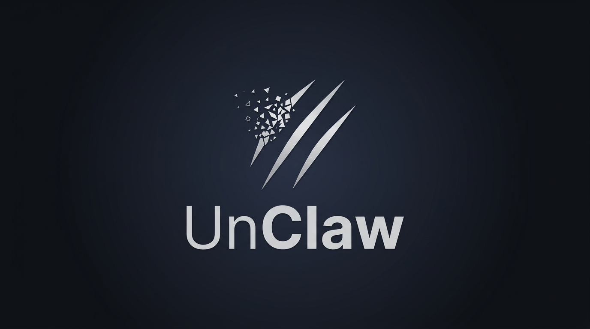

<p align="center">
  
</p>

<p align="center">
  <strong>Turn Claude Code into your personal AI agent. No harness required.</strong><br>
  No framework. No runtime. No API costs. Works with your existing Max subscription.
</p>

<p align="center">
  <a href="#quick-start">Quick Start</a>&nbsp; · &nbsp;
  <a href="#multiple-agents-one-template">Multiple Agents</a>&nbsp; · &nbsp;
  <a href="#how-it-works">How It Works</a>&nbsp; · &nbsp;
  <a href="#philosophy">Philosophy</a>&nbsp; · &nbsp;
  <a href="#faq">FAQ</a>
</p>

<p align="center">
  <a href="https://github.com/shahshrey/unclaw/blob/main/LICENSE"></a>&nbsp;
  <a href="https://docs.anthropic.com/en/docs/claude-code"></a>&nbsp;
  <a href="https://github.com/shahshrey/unclaw/stargazers"></a>
</p>

---

> *"The best AI agent framework is the one you delete."*

Here's the dirty secret about personal AI agent frameworks: **Anthropic doesn't let third-party harnesses use your Claude Max subscription.** OpenClaw, NanoClaw, and every other custom runtime hit the API directly — and API costs add up fast. We're talking hundreds of dollars a month for a personal agent.

UnClaw sidesteps this entirely. It runs inside Claude Code, which means it uses your existing Claude Pro/Max/Team subscription. Same agent capabilities. **Zero additional cost.**

And because Claude Code already is a full agent runtime — tools, file access, shell, subagents, MCP servers — UnClaw doesn't need to build one. It just needs the right config files.

Three commands. That's it.

```bash
git clone https://github.com/shahshrey/unclaw my-agent
cd my-agent
claude   # then type: /setup
```

Your agent picks a name, builds its memory structure, installs hooks, and optionally connects Telegram — all inside Claude Code. No `npm install`. No Docker. No build step.

---

## How UnClaw Compares

Choosing a personal AI agent setup? Here's how the options stack up:

|  | **OpenClaw** | **NanoClaw** | **UnClaw** |
|---|---|---|---|
| **Cost** | API usage ($$$/month) | API usage ($$$/month) | **$0 — uses your Max subscription** |
| **Uses Claude Max/Pro?** | No — requires API key | No — requires API key | **Yes — runs inside Claude Code** |
| **What it is** | Full agent framework | Lightweight agent runtime | Config template for Claude Code |
| **Runtime** | Custom Node.js harness | Custom Node.js process | Claude Code (no custom runtime) |
| **Lines of code** | ~500K | ~5K | **0** (markdown + shell scripts) |
| **Dependencies** | 70+ npm packages | Node.js + Docker | **None** (just Claude Code) |
| **Isolation** | Application-level | Container-level | Claude Code's built-in sandbox |
| **Setup** | Complex multi-step | `/setup` skill | `/setup` skill |
| **When Claude Code updates** | Wait for harness patch | Wait for compatibility fix | **Nothing breaks** |
| **Maintenance burden** | High | Low | **Near zero** |
| **Memory system** | Built-in | Per-group CLAUDE.md | Hot/cold/raw with FTS5 search |
| **Messaging** | Multiple channels | Multiple channels | Telegram (more via MCP) |
| **Self-improvement** | No | No | **Yes** — nightly skill/rule refinement |
| **Multi-agent** | Single runtime, shared config | Per-group isolation | **Full directory isolation** — separate tools, skills, rules, memory per agent |
| **Philosophy** | Feature-rich platform | Small, secure runtime | **Delete the framework entirely** |

UnClaw's bet: the best harness is the one you don't maintain — and don't pay for separately. Claude Code handles tools, file access, shell, subagents, and MCP servers, all on your existing subscription. UnClaw just adds what Claude Code doesn't have natively: **identity**, **persistent memory**, and **a schedule**.

---

## Quick Start

```bash
git clone https://github.com/shahshrey/unclaw my-agent
cd my-agent
claude
```

Type `/setup` inside Claude Code. It walks you through everything:

1. **Identity** — name your agent, define its role and personality
2. **Memory** — creates the hot/cold/raw memory structure
3. **Hooks** — installs session lifecycle hooks for automatic logging
4. **Telegram** *(optional)* — connects a bot so you can message your agent from your phone
5. **Scheduling** *(optional)* — sets up heartbeats, memory promotion, and self-improvement via launchd

<details>
<summary>Alternative: shell-based setup</summary>

```bash
./bin/setup.sh
```

</details>

> **Note:** `/setup`, `/heartbeat`, and other `/commands` are [Claude Code skills](https://docs.anthropic.com/en/docs/claude-code). Type them inside the `claude` prompt, not in your terminal. Need Claude Code? Get it at [claude.ai/download](https://claude.ai/download).

---

## Philosophy

**You're already paying for an agent runtime.** If you have a Claude Pro, Max, or Team subscription, you have Claude Code. Claude Code runs tools, reads files, executes shell commands, manages subagents, and connects to MCP servers. That's an agent runtime. It's already on your machine. Every other agent framework ignores this and makes you pay API costs on top of your subscription. UnClaw doesn't.

**Zero lines of runtime code.** UnClaw is markdown files, shell scripts, and a Python indexer. There is no application to run, no process to manage, no binary to compile. Claude Code is the only process. UnClaw is the directory it reads on startup.

**Config as architecture.** `identity/SOUL.md` is the personality. `CLAUDE.md` is the operating system. `identity/memory.md` is the brain. `.claude/rules/` are the guardrails. `.claude/skills/` are the capabilities. All plain text. All version-controlled. All natively understood by Claude Code without any adapter layer.

**Built for one person.** Not a platform. Not a SaaS. A template that one person clones, personalizes, and owns. Your agent knows your name, your projects, your communication style. It's not designed to scale to a thousand users. It's designed to be perfect for one.

**Agents should get better at being *your* agent.** Memory promotes from daily logs to long-term storage. The agent reviews its own skills and rules nightly. The longer you use it, the more it understands your patterns. This isn't a stateless chatbot — it's a persistent collaborator.

**Isolation by default.** Need multiple agents? Clone the repo again. Each agent gets its own tools, skills, security rules, memory, and Telegram bot. No shared state, no cross-domain context bleed, no confused context windows. Isolation isn't an afterthought bolted onto a monolith — it's just how directories work.

**Skills, not features.** Want web research? It's a skill file. Morning standup? Skill file. The template stays lean because capabilities live in `.claude/skills/`, not in source code someone has to maintain.

---

## What You Get

- **Persistent identity** — identity/SOUL.md personality + CLAUDE.md operational config, loaded every session
- **Long-term memory** — hot/cold/raw three-layer architecture with SQLite FTS5 full-text search
- **Automatic daily logs** — session summaries captured via hooks, never lose context again
- **Telegram messaging** — optional; chat with your agent from your phone
- **Scheduled tasks** — heartbeats, memory promotion, self-improvement via macOS launchd
- **Watchdog** — auto-recovery if the session dies
- **Web research** — search and scrape via skills and MCP servers
- **Subagents** — delegate to specialized agents for parallel work
- **Self-setup** — `/setup` and Claude configures itself
- **Self-improvement** — nightly reviews of skills, rules, and hooks

---

## Multiple Agents, One Template

Need more than one agent? Clone the repo again.

```bash
git clone https://github.com/shahshrey/unclaw content-writer
git clone https://github.com/shahshrey/unclaw financial-analyst
git clone https://github.com/shahshrey/unclaw dev-agent
```

Each clone runs `/setup` independently. During setup, you tell Claude Code what this agent's role is — content writer, financial analyst, software engineer, research assistant, whatever. The setup skill generates domain-specific rules, skills, and guardrails tailored to that role.

```
~/content-writer/              ~/financial-analyst/           ~/dev-agent/
├── identity/                  ├── identity/                  ├── identity/
│   └── SOUL.md (writer)       │   └── SOUL.md (analyst)      │   └── SOUL.md (engineer)
├── .claude/rules/             ├── .claude/rules/             ├── .claude/rules/
│   └── domain.md              │   └── domain.md              │   └── domain.md
│     (tone, SEO,              │     (data sourcing,           │     (code conventions,
│      publishing)             │      model standards)         │      testing, linting)
├── .claude/skills/            ├── .claude/skills/            ├── .claude/skills/
│   └── (writing tools)        │   └── (analysis tools)       │   └── (dev tools)
├── memory/                    ├── memory/                    ├── memory/
└── Telegram: @writer_bot      └── Telegram: @analyst_bot     └── Telegram: @dev_bot
```

**Why this matters:**

- **Isolated tools.** Your financial analyst doesn't have access to your code deployment scripts. Your content writer doesn't see your financial models. Each agent only has the tools it needs.

- **Isolated skills.** Domain-specific skills live in each agent's `.claude/skills/` directory. No skill conflicts, no bloat from capabilities the agent will never use.

- **Isolated security.** Each agent gets its own `.claude/rules/security.md` and domain guardrails. Your dev agent might have shell access to production servers. Your content writer never will. The isolation isn't application-level — it's directory-level. Separate directories, separate permissions, separate MCP server configs.

- **Isolated memory.** Each agent has its own `identity/memory.md`, its own daily logs, its own conversation history. Your financial analyst's context window isn't polluted with your dev agent's debugging sessions. The agent stays focused because its entire context is scoped to its domain.

- **Isolated Telegram threads.** Each agent gets its own Telegram bot. Message `@writer_bot` for content help, `@analyst_bot` for financial questions. Clean separation — no confused context, no cross-domain bleed.

- **Clean context windows.** This is the quiet win. When an agent only knows about its own domain, every token in the context window is relevant. No wasted context on skills, rules, and memory from domains the agent doesn't touch.

The multi-agent pattern is just the single-agent pattern repeated. No orchestrator needed. No shared state to manage. Each agent is a self-contained directory that Claude Code reads on startup.

---

## How It Works

```
YOU (terminal / tmux / Telegram)
  │
  ▼
Claude Code (the only process)
  │
  ├── reads CLAUDE.md ← @identity/SOUL.md, @identity/user.md, @identity/memory.md, @rules
  ├── discovers .claude/skills/ ← /heartbeat, /promote, /search-memory ...
  ├── runs hooks ← SessionStart, PreCompact, SessionEnd ...
  │
  ▼
Memory (plain files, searched via SQLite FTS5)
  ├── identity/memory.md → hot: always in context, <2500 tokens
  ├── memory/*.md        → cold: searched on-demand
  └── daily-logs/*.md    → raw: full history, indexed
```

That's it. No orchestrator. No message queue. No container runtime. Claude Code boots, reads the config files, and becomes your agent.

### Key Files

| File | Purpose |
|------|---------|
| `CLAUDE.md` | Agent operating system — imports everything else |
| `identity/SOUL.md` | Personality, voice, boundaries |
| `identity/user.md` | Owner profile and preferences |
| `identity/memory.md` | Hot memory — always loaded, under 2500 tokens |
| `config/agent.env` | Session name, channel config |
| `bin/setup.sh` | Interactive setup script |
| `bin/start-agent.sh` | Starts the agent in a tmux session |
| `.claude/settings.json` | Hooks configuration |
| `.claude/rules/` | Security, communication, domain guardrails |
| `.claude/skills/` | All agent capabilities as skill files |
| `.claude/scripts/` | Shell/Python helpers for scheduling and indexing |

---

## Memory

Three layers. Signal flows upward automatically.

```
daily-logs/*.md  →  memory/*.md  →  identity/memory.md
    (raw)              (cold)             (hot)
  indexed in         searched            loaded
  SQLite FTS5        on-demand          every turn
```

| Layer | Loaded | What's in it |
|-------|--------|-------------|
| **Hot** | Every turn | Current priorities, active projects, key facts |
| **Cold** | On-demand | Project history, preferences, decisions, people |
| **Raw** | Via search | Full conversation logs from every session |

`/promote` extracts signal from raw -> cold -> hot. `/search-memory` queries across all three.

---

## Built-in Skills

```
/setup              Bootstrap the agent from scratch
/heartbeat          Proactive check-in, surfaces actionable items
/daily-standup      Morning briefing: tasks, priorities, schedule
/distill-session    Save session context to daily logs
/promote            Extract learnings into long-term memory
/search-memory      Search across all past sessions
/memory-update      Manually update long-term memory
/research           Web research on any topic
/self-improve       Review and improve own skills, rules, hooks
```

Add your own: drop a `SKILL.md` file in `.claude/skills/<name>/`. Claude Code discovers it automatically.

---

## Scheduling

Recurring tasks via macOS launchd. Adapt to systemd or cron on Linux.

| Task | Interval | Purpose |
|------|----------|---------|
| Heartbeat | 30 min | System context check, surfaces actionable items |
| Distill | 6 hours | Writes session summary to daily log |
| Promote | 24 hours | Extracts learnings from logs into memory |
| Self-improve | 2 AM nightly | Reviews and refines skills, rules, hooks |
| Watchdog | 5 min | Health check, auto-restarts if needed |

---

## Customizing

Everything is plain text. Modify directly or tell your agent what to change — it has permission to edit its own config.

| Want to change... | Edit this |
|---|---|
| Personality & voice | `identity/SOUL.md` |
| Operational rules | `.claude/rules/*.md` |
| Capabilities | `.claude/skills/<name>/SKILL.md` |
| What the agent remembers | `identity/memory.md` or run `/memory-update` |
| Scheduling | `templates/launchd/` or tell the agent |

---

## FAQ

<details>
<summary><strong>Why can't I just use OpenClaw or NanoClaw with my Max subscription?</strong></summary>

Anthropic doesn't allow third-party harnesses to use Claude Max/Pro subscriptions. OpenClaw, NanoClaw, and similar frameworks must use the API directly, which means you're paying per-token on top of your subscription. UnClaw runs inside Claude Code itself, so it uses whatever plan you already have. If you're on Max, your agent costs nothing extra to run.
</details>

<details>
<summary><strong>How is this different from OpenClaw?</strong></summary>

OpenClaw is a full agent framework — custom runtime, 70+ dependencies, half a million lines of code. It also requires API access, not a subscription. UnClaw uses Claude Code as the runtime directly. There's no application code to maintain, and no separate API bill. When Claude Code ships improvements, UnClaw gets them for free.
</details>

<details>
<summary><strong>How is this different from NanoClaw?</strong></summary>

NanoClaw is a lightweight runtime with container isolation and multi-channel orchestration. It's well-built, but it still runs a custom Node.js process that hits the API directly — meaning API costs. UnClaw runs nothing. Claude Code is the only process, running on your subscription. UnClaw is a directory of config files.
</details>

<details>
<summary><strong>Is this just a dotfiles repo?</strong></summary>

Yes. That's the whole point. The best framework is the one you delete. UnClaw is what's left after you remove the runtime, the wrapper, the build step, and the dependency tree. Just the config that makes Claude Code act like a personal agent.
</details>

<details>
<summary><strong>What happens when Claude Code updates?</strong></summary>

Nothing breaks. UnClaw doesn't wrap, patch, or monkey-patch Claude Code. It uses documented, stable features: `CLAUDE.md`, hooks, skills, MCP servers. No dependency chain to untangle.
</details>

<details>
<summary><strong>Does it work with Cursor?</strong></summary>

Yes. Skills, memory, and rules work in Cursor. Scheduling and Telegram require the Claude Code CLI, but the core agent experience works in any environment that reads `CLAUDE.md`.
</details>

<details>
<summary><strong>Can I run multiple agents?</strong></summary>

Yes — and you should. Clone the template once per role: content writer, financial analyst, dev agent, whatever you need. Each clone gets its own identity, skills, rules, memory, security guardrails, and optional Telegram bot. There's no shared state between them. See the [Multiple Agents](#multiple-agents-one-template) section for the full pattern.
</details>

<details>
<summary><strong>Why not just use Claude Code directly?</strong></summary>

You can. UnClaw is what you'd end up with if you spent a weekend turning Claude Code into a persistent agent with a personality, long-term memory, scheduled tasks, and messaging. The template saves you that weekend.
</details>

---

## Requirements

- [Claude Code](https://docs.anthropic.com/en/docs/claude-code) v2.1+
- Any Claude subscription — **Pro, Max, Team, or Enterprise** (no separate API key needed)
- macOS or Linux
- tmux (`brew install tmux`)
- Python 3.9+ (ships with macOS)
- Bun (only for Telegram: `curl -fsSL https://bun.sh/install | bash`)

> Already paying for Claude Max? That's all you need. No API key. No usage-based billing. Your agent runs on the subscription you already have.

---

## Inspired By

- [OpenClaw](https://github.com/openclaw/openclaw) — SOUL.md, memory architecture, safety guardrails
- [NanoClaw](https://github.com/qwibitai/nanoclaw) — minimalist philosophy, skills-over-features
- Cole Medin's "second brain" pattern — daily logs, PreCompact hooks, promotion pipeline

---

## Star History

If UnClaw saved you a weekend of config wrangling, a star helps others find it.

<p align="center">
  <a href="https://github.com/shahshrey/unclaw/stargazers">
    
  </a>
</p>

---

<p align="center">
  MIT License &nbsp;·&nbsp; Built by <a href="https://github.com/shahshrey">@shahshrey</a>
</p>
